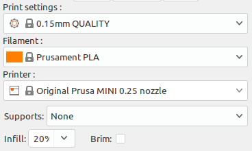
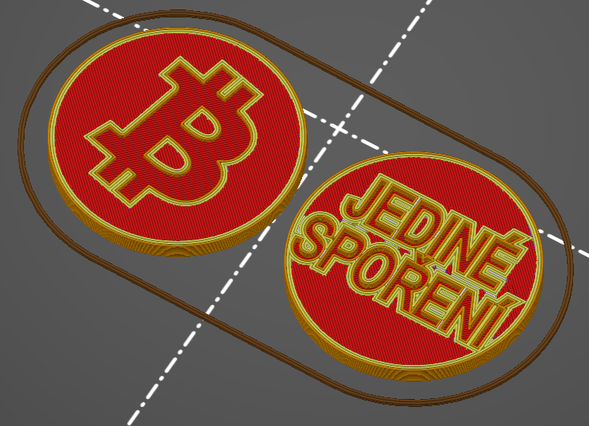
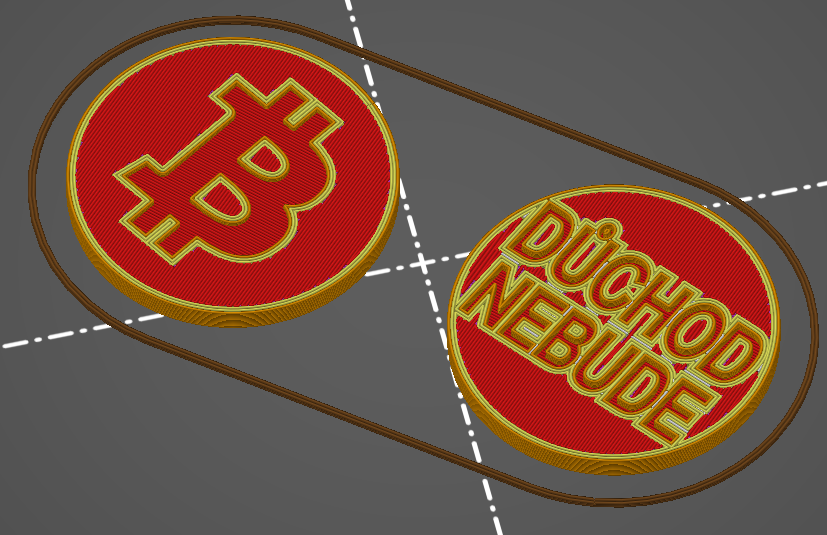
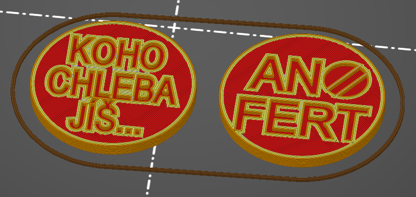

# Moudrý žeton
Žetony do nákupních vozíků s různou tématikou.

Tyto, žetony jsou určené k vytisknutí na 3D tiskárně a k ponechání v nákupním vozíku.  
Žeton je o velikosti mince 5 Kč(23mm x 1.85mm)  

## Jak přispět
Jakýkoli nový model, který rozšíří sbírku je vítaný. Modely přidávejte do tohoto repository prostřednictvím Forku a Pull Requestu.

## Doporučené nastavení tiskárny pro tisk

## BTC - Jediné spoření 
*Má smysl spořit ve státem poskytovaných nástrojích?*
- [Stáhnout BLENDER](blender/btc_jedine_sporeni.blend)
- [Stáhnout STL](stl/btc_jedine_sporeni.stl)

**_Náhled zobrazuje dvě strany téže mince. Není potřeba je slepovat._**

## BTC - Důchod nebude 
*Existuje ještě někdo pod 30let kdo si myslí, že ho čeká nějaký důchod?*
- [Stáhnout BLENDER](blender/btc_duchod_nebude.blend)
- [Stáhnout STL](stl/btc_duchod_nebude.stl)

**_Náhled zobrazuje dvě strany téže mince. Není potřeba je slepovat._**

## ANOFERT
*Koho chleba jíš, toho píseň zpívej - Lidová moudrost*
- [Stáhnout BLENDER](blender/anofert_koho_chleba.blend)
- [Stáhnout STL](stl/anofert_koho_chleba.stl)

**_Náhled zobrazuje dvě strany téže mince. Není potřeba je slepovat._**

